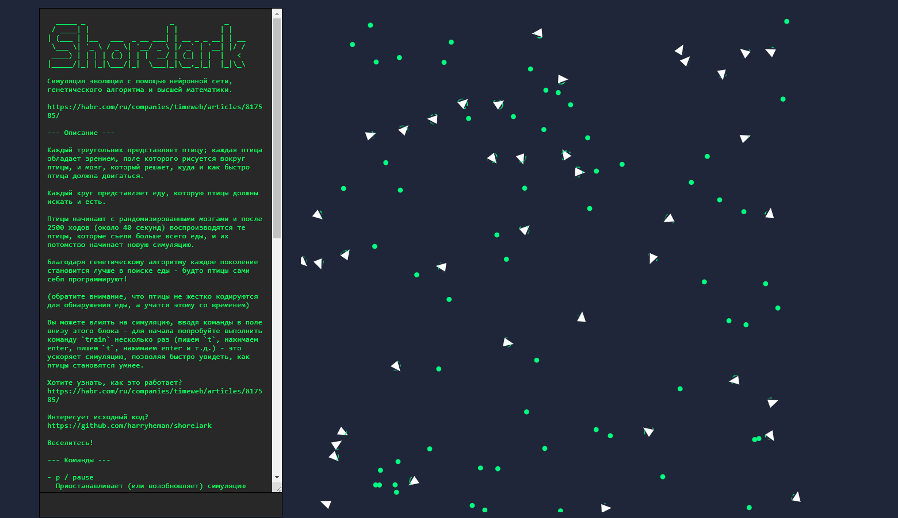

# 🐦 Shorelark

> [Оригинал](https://pwy.io/posts/learning-to-fly-pt1/)

Симуляция эволюции с помощью нейронной сети, генетического алгоритма и высшей математики:



Интересно, как это работает? [Учимся летать](https://habr.com/ru/companies/timeweb/articles/817585/).

## Демо

> [https://shorelark.netlify.app/](https://shorelark.netlify.app/)

## Запуск

### Cargo и npm

Требуется `cargo`, `npm` и `wasm-pack` (0.11.0):

```bash
# Клонируем репозиторий
$ git clone https://github.com/harryheman/shorelark.git
$ cd shorelark

# Компилируем код Rust
$ cd libs/simulation-wasm
$ wasm-pack build --release

# Устанавливаем зависимости JavaScript
$ cd ../../www
$ npm i

# Запускаем приложение JavaScript в режиме разработки
$ npm run dev
```

## Использование

Приложение содержит инструкцию в терминале слева.

## Лицензия

Проект находится под лицензией [MIT](LICENSE).
